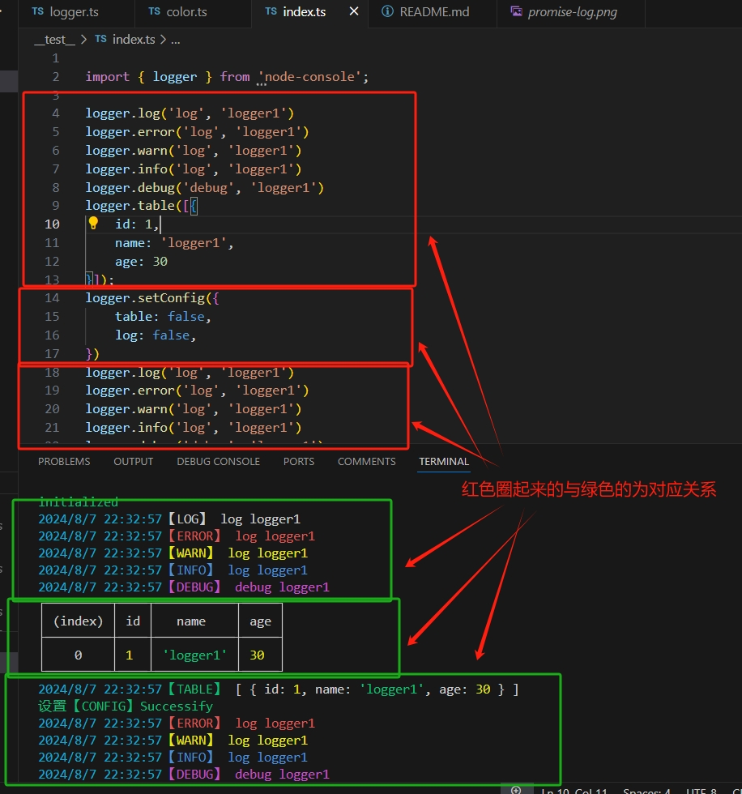
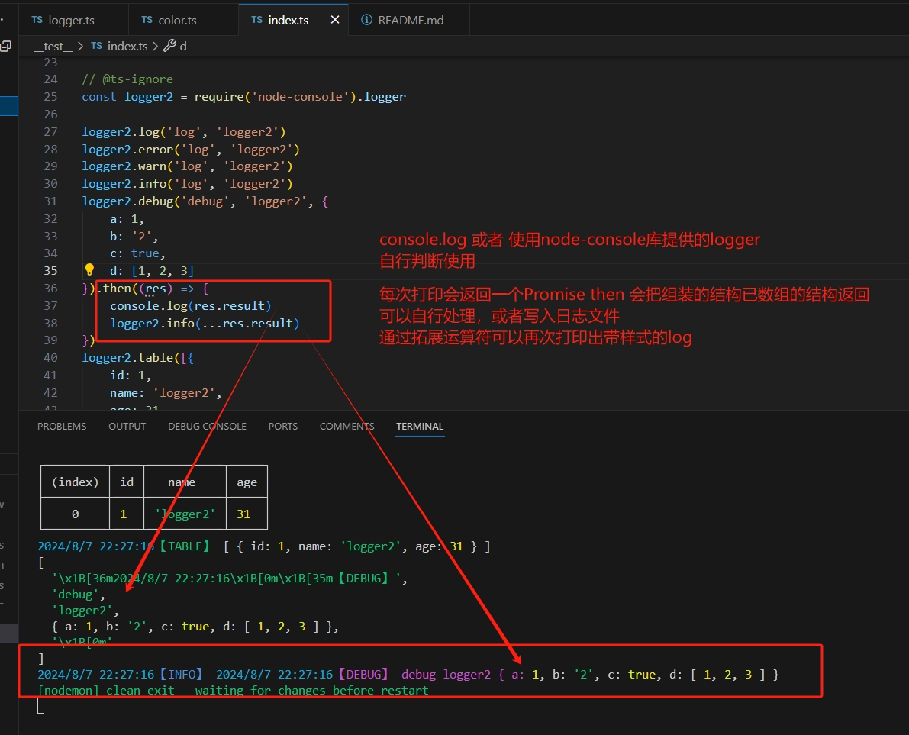

## 打印日志

- 提供来commonjs和esmodule 两个类型

- 每次打印会返回一个Promise then 会把组装的结构已数组的结构返回
- 可以自行处理，或者写入日志文件
- 通过拓展运算符可以再次打印出带样式的log



### 使用
```js
import { logger } from 'node-console';
// const logger = require('node-console').logger;
logger.log('log', 'logger1')
logger.error('log', 'logger1')
logger.warn('log', 'logger1')
logger.info('log', 'logger1')
logger.debug('debug', 'logger1')
logger.table([{
    id: 1,
    name: 'logger1',
    age: 30
}]);

```
### 控制打印时机
```js
/**
 * @desc 默认为true
 *  log: true,
    debug: true,
    info: true,
    warn: true,
    error: true,
    table: true,
 */
// 设置对于字段false 或者true 控制是否打印日志
logger.setConfig({
    debug: false, //  比如debug默认设置这个false 减少不必然的打印，在特定阶段再开启打印
});
```
### Color
- 比如希望打印一个有颜色的字体你可以这样：
```js
import { logger, Color } from 'node-console';
/**
 * @desc 默认内置以下颜色
    red
    green
    yellow
    blue
    magenta
    cyan
    white
 */
console.log(Color.green(msg));
// 或者
logger.log(Color.green(msg));

```
- 如果你希望预设一些颜色，你可以这样
```js
import { colors } from 'node-console';
// 例子
colors['red'] = "\x1b[31m";
colors['green'] = "\x1b[32m";

```